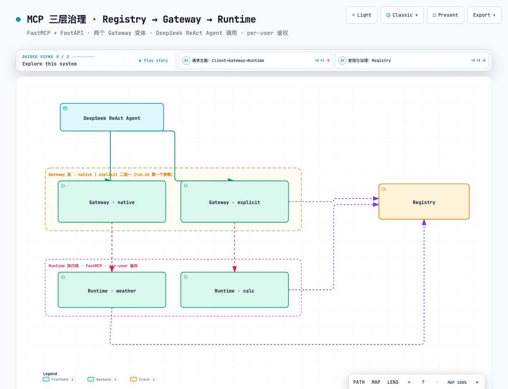

# MCP 三层治理 demo · Registry → Gateway → Runtime

[](https://github.com/helloworldtang/mcp-governance-mvp/actions/workflows/ci.yml)
[](LICENSE)

Python 端到端 demo，把 MCP（Model Context Protocol）的**三层治理过程**完整跑给人看：发现 → 路由 → 执行。基于业界调研选型 **FastMCP + FastAPI**，做了**两个 Gateway 变体对比**（声明式 `mount(create_proxy)` vs 手写逐跳转发），用 **DeepSeek ReAct Agent** 当调用方，让治理流程在真实工具选择中显形。

> **定位**：教学 MVP —— 架构与机制（三层切分、无状态协议、执行点 per-user 鉴权、数据面 trace+审计）与生产 **1:1 对得上**；但安全/可靠性横切（明文身份头、静态 key、无 TLS/限流/HA）是刻意的教学简化，**不是 drop-in 生产代码**。生产替换路径见末尾「扩展」。

> 三层成立的协议前提：2026-07-28 MCP 规范把协议改成**无状态、可路由、可缓存**的请求/响应模型（废弃 `initialize` 握手与 session id）。身份随每个请求走 header —— 这是 Gateway 能路由、Runtime 能做 per-user 鉴权的根基。本 demo 全程 `stateless_http=True`。

## 架构图



> 🖱️ **交互版**（主题切换、引导视图、关系探查、节点搜索）：浏览器打开 [`architecture.html`](architecture.html)（由 [archify](https://github.com/) 生成，自包含单文件）。源文件 `mcp-governance.architecture.json`。

## 架构（纯文本版）

```
        DeepSeek ReAct Agent (client/run.py)
        带 Authorization: Bearer <key-alice|key-bob>
                  │  Streamable HTTP  :8200/mcp
                  ▼
        ┌──────────────────────────────────────────────┐
        │ Gateway  (二选一，run.sh 第一个参数切换)    │
        │  native   = mount(create_proxy(rt), ns=...)   │  gateway/fastmcp_native.py
        │             + AuthInjectMiddleware 注入身份     │
        │  explicit = 手写 _forward() 逐跳转发           │  gateway/explicit_proxy.py
        └──────────────┬───────────────────────────────┘
                       │ 启动时 GET /servers 拉目录，按 namespace 路由
                       ▼
        ┌──────────────────────────────────────────────┐
        │ Registry (FastAPI :8100)                     │  registry/server.py
        │  POST /register · GET /servers · GET /health │
        │  后台周期心跳，标记各 Runtime up/down          │
        └──────────────▲───────────────────────────────┘
                       │ 启动时自注册
        ┌──────────────┴──────────────┐
        ▼                             ▼
  weather (:8300)                 calc (:8301)        runtime/weather.py · runtime/calc.py
   get_forecast [read]             add [read]         每个 tool：get_http_request() 读 X-User/X-Role
   reset_cache  [admin]            multiply [read]    → 执行点做 per-user 鉴权 → 审计
```

## 业界调研：三层谁做得最好

各层 best-in-class 不同，没有单一厂商三层都第一：

| 层 | 生产级 best-in-class | 本 demo 对应 | 选型理由 |
|---|---|---|---|
| **Registry** 发现 | GitHub MCP Registry、Smithery、JFrog MCP | `registry/server.py` (FastAPI 内存目录) | Registry 本质是元数据目录 + 健康检查，自建最清晰；官方 Registry 还在成形期 |
| **Gateway** 路由 | Microsoft **mcp-gateway**、Kong Konnect、Portkey、Tyk | `gateway/fastmcp_native.py` (`mount`+`create_proxy`) | FastMCP 把组合/代理/命名空间做成一等原语，几行就是 Gateway |
| **Runtime** 执行 | **Arcade**（per-user OAuth 托管）、Cloudflare McpAgent+Durable Objects、FastMCP Horizon | `runtime/*.py` (FastMCP) | FastMCP 是 reference 实现，本地跑、能展示执行点鉴权 + 审计 |

**单语言、全本地、三层都讲得清的最优栈 = Python + FastMCP（+ FastAPI 写 Registry / 显式 Gateway）。** 生产路径：FastMCP 自建版 ≈ FastMCP Horizon 托管 / Arcade。

## 能力清单（file:line）

| 能力 | 位置 | 说明 |
|---|---|---|
| **Registry** 注册/发现 | `registry/server.py:73` `register`、`:88` `servers` | Runtime 自荐 + Gateway 拉目录 |
| Registry 周期心跳 | `registry/server.py:37` `_health_loop` | 标记 Runtime up/down，down 的不路由 |
| **Runtime** 执行点鉴权 | `runtime/authz.py:14` `current_identity`、`:24` `require_admin` | 读 X-User/X-Role，admin 门禁抛 `ToolError` |
| Runtime read 工具 | `runtime/weather.py:42` `get_forecast`、`runtime/calc.py:28` `add` | 任何身份可调 |
| Runtime admin 工具 | `runtime/weather.py:52` `reset_cache` | 仅 admin；viewer 在执行点被拒 |
| Runtime 自注册 | `runtime/weather.py:61` `_self_register` | 启动 POST 到 Registry |
| **Gateway 变体 A** 声明式 | `gateway/fastmcp_native.py:71` `mount(create_proxy(...))` | 一行挂一个后端 |
| Gateway A 鉴权注入 | `gateway/fastmcp_native.py:26` `AuthInjectMiddleware` | 解析 Authorization → 注入 X-User/X-Role |
| **Gateway 变体 B** 手写转发 | `gateway/explicit_proxy.py:54` `_forward` | 鉴权 → 连后端带身份 → call_tool，逐跳可见 |
| Gateway B 动态代理 tool | `gateway/explicit_proxy.py:72` `_build_proxy_tool` | 按后端 inputSchema 重建签名 |
| **Client** DeepSeek Agent | `client/agent.py:75` `create_react_agent` | langgraph ReAct 选工具 |
| Client 带身份连网关 | `client/agent.py:43` `MultiServerMCPClient` | transport=http + Authorization 头 |
| 身份映射 | `core/config.py:28` `API_KEYS` | key-alice→admin · key-bob→viewer |
| **数据面 trace** | `client/agent.py` `run_task` 生成 `X-Trace-Id` | Gateway 透传，Runtime 连同身份打日志 |
| **数据面审计** | `core/audit.py` → `output/audit.jsonl` | 每次 allow/deny 落 JSONL（Runtime 审计职责） |

## 三层各自做了什么（职责切分，是本 demo 的核心）

| 层 | 关心 | 不关心 | demo 体现 |
|---|---|---|---|
| **Registry** | 有哪些工具/服务、它们活没活 | 请求怎么路由、怎么执行 | `GET /servers` 给 Gateway 建路由表 |
| **Gateway** | 这个 key 合法吗（粗鉴权）、请求往哪转 | 工具具体怎么跑、用户能不能调 | 解析 Authorization → 注入身份 → 按 namespace 路由 |
| **Runtime** | 这个用户**能调这个工具吗**（细鉴权）、跑成什么样 | 全局有多少工具 | 执行点 `require_admin()`；admin 工具对 viewer 说"不" |

> 关键区分：**Gateway 做"租户级粗鉴权"（key 认不认），Runtime 做"工具级细鉴权"（这个用户能不能调这个工具）**。后者是网关层做不到的 —— 也是 Arcade 这类 Runtime 的核心卖点。

## 控制面 vs 数据面（数据面可观测）

三层治理拆开看，其实是两张"飞机"：

| 面 | 承载 | 本 demo | 协议 |
|---|---|---|---|
| **控制面** | 元数据 + 策略（谁、能调什么、到哪） | Registry `/register` `/servers` `/health`、Gateway 的 `key→role` 映射 + 路由表、Runtime 鉴权规则 | REST |
| **数据面** | 工具调用的真实载荷 `tools/call` | Client→Gateway→Runtime 的参数 + 结果流 | MCP streamable-http |

- **Gateway 横跨两面**：在数据面转发载荷，每次转发查控制面做鉴权 + 路由（像 Envoy/Kong）。
- **Registry 是纯控制面**：零工具数据流过它。
- **Runtime 是数据面终点**：执行工具；它的鉴权规则属控制面。

**数据面可观测 = trace ID + 审计日志**，把抽象的"数据面"变成可追的活过程：

```
[trace:8a275f] 🤖 client    身份 bob(viewer)  任务: 把天气缓存清掉
[trace:8a275f] 🚪 gateway   路由 weather_reset_cache → :8300  身份 bob(viewer)
[trace:8a275f] ⚙️ runtime   reset_cache ← bob(viewer) → DENIED 🔒
```
同一个 `8a275f` 串起三层。每次调用还落一行 `output/audit.jsonl`（数据面留痕，Runtime 审计职责的落地）：

```jsonl
{"trace":"8a275f","user":"bob","role":"viewer","tool":"weather_reset_cache","decision":"deny","detail":"role=viewer 非 admin"}
{"trace":"8f5d6b","user":"alice","role":"admin","tool":"weather_get_forecast","decision":"allow","detail":"city=上海 → 上海 晴 28℃"}
{"trace":"456c76","user":"alice","role":"admin","tool":"weather_reset_cache","decision":"allow","detail":"cleared 6"}
```

> 这是 OpenTelemetry + SIEM 的玩具版：trace ID 对应分布式追踪，`audit.jsonl` 对应审计 sink。生产替换路径见末尾「扩展」。

## 教学主线：per-user 鉴权，三层职责肉眼可分

两个 API key 映射两套身份（`core/config.py:28`）：
- `key-alice` → `alice` / **admin**：全部工具可调
- `key-bob` → `bob` / **viewer**：只能调 `read` 工具；admin 工具在 Runtime 执行点被拒

| 任务 | 用户 | 结果 | 拒在哪一层 |
|---|---|---|---|
| 查上海天气 | bob(viewer) | ✔ 成功 | —（read 工具，三层都放行）|
| 清天气缓存 | bob(viewer) | ✘ **DENIED** | **Runtime 执行点**（viewer 无 admin）|
| 清天气缓存 | alice(admin) | ✔ 成功 | —（admin 放行）|
| 任意调用 | bad-key | ✘ 401 | **Gateway 边缘**（粗鉴权不认）|

`bob 清缓存` 那条是核心：Gateway 放行了（key 合法），但 **Runtime 在执行点拒绝** —— 这正是三层分离的价值。

## 两个 Gateway 变体对比

同一份 Registry + Runtime + Client，只换 Gateway。对比轴 = **转发机制是声明式还是手写**：

| | 变体 A `native` | 变体 B `explicit` |
|---|---|---|
| 转发写法 | `gw.mount(create_proxy(url), namespace=ns)` 一行/后端 | `_forward()` 手写：解析身份 → 连后端 → `call_tool` |
| 路由/命名空间 | FastMCP ProxyProvider 自动（黑盒） | 自己 list 后端工具 + 按 namespace 注册代理 tool |
| 身份注入 | ASGI middleware 注入 X-User/X-Role，create_proxy 透传 | 每个 `_forward()` 显式塞进 `StreamableHttpTransport(headers=)` |
| 入参 schema | 自动透传后端 schema | `_build_proxy_tool` 按 inputSchema 重建签名（`__signature__`+`__annotations__`）|
| Gateway 日志量 | 少（只有"就绪 + 鉴权注入"） | 多（每次调用"路由 → ←"两行，每跳可见）|
| 代码量 | ~80 行（含 middleware） | ~120 行 |
| 像谁 | 像用 FastMCP / Horizon 的开发者 | 像 Kong / Microsoft mcp-gateway 的实现 |

跑 `./compare_gateways.sh "查一下北京天气" --user bob` 一眼看到差别：native 的 🚪 行很少（路由在黑盒），explicit 每跳都打日志。

## 快速开始

前置：装好 [uv](https://docs.astral.sh/uv/)（`curl -LsSf https://astral.sh/install.sh | sh`），Python 3.11+ 由 uv 自动拉取。

```bash
# 0. 装依赖（uv 自动装 Python 3.12）
uv sync

# 1. 必填：DeepSeek API Key（Client 的 ReAct Agent 用）
export DEEPSEEK_API_KEY=sk-...   # 或写进 .env（看 .env.example）

# 2. 基本流：explicit Gateway，bob 查天气 → 成功
./run.sh explicit "查一下上海天气" --user bob

# 3. per-user 鉴权拒绝：bob 清缓存 → 被 Runtime 拒
./run.sh explicit "把天气缓存清掉" --user bob

# 4. 同任务 alice → 成功
./run.sh explicit "把天气缓存清掉" --user alice

# 5. 换 native Gateway，行为一致
./run.sh native "把天气缓存清掉" --user bob

# 6. 两变体并排对比
./compare_gateways.sh "查一下北京天气" --user bob
```

每次运行的 Agent 转写落在 `output/<时间戳>.<user>.txt`；各层进程日志在 `/tmp/mcp_{registry,weather,calc,gateway}.log`。

## 避坑（踩出来的，都在代码里有注释）

1. **`get_http_headers()` 会剔除 `Authorization` 等标准头**。读鉴权头必须走 `get_http_request().headers`（原始请求头）。—— `gateway/explicit_proxy.py:39` 的注释。
2. **FastMCP 的 `create_proxy` 会自动透传入站 HTTP header 到后端**（已验证：client 的 X-User 到了 weather）。所以变体 A 用 middleware 注入 X-User/X-Role，create_proxy 就能带到 Runtime。无需 fallback。
3. **默认 streamable-http 是有状态的**（要 `Mcp-Session-Id`）。本 demo 全用 `mcp.http_app(stateless_http=True)`，对齐 2026-07-28 无状态协议，反代不必维护会话。
4. **动态代理 tool 要同时注入 `__signature__` 和 `__annotations__`**：FastMCP/pydantic 用 `get_type_hints`（读 `__annotations__`）+ `inspect.signature` 推导 schema，缺一不可。—— `gateway/explicit_proxy.py:72`。
5. **进程清理按端口，别只靠 `pkill -f`**：模块名匹配偶尔漏，旧 Gateway 占着端口会让新进程 `Errno 48` 静默失败（client 连到旧代码）。`run.sh` 用 `lsof -ti :PORT | xargs kill`。
6. **macOS 的 BSD sed 不支持 `\|` 交替**：脚本里过滤用 `grep -E`，别用 sed。

## 代码风格（生产级，按 [python-code-style](https://skills.sh/wshobson/agents/python-code-style) skill）

- **ruff**(lint + format，替代 black/isort/flake8)+ **mypy**(strict 类型检查)，配置在 `pyproject.toml` 的 `[tool.ruff]` / `[tool.mypy]`。
- 规约：行长 120、双引号、PEP8 命名、导入三分组(stdlib→三方→本地)、绝对导入、Google-style docstring、所有 public API 带类型注解。
- 框架无 stub 的模块（`fastmcp`/`langchain_mcp_adapters`/`langgraph`/`starlette`）在 mypy overrides 里 `ignore_missing_imports`；框架 TypedDict 歧义等 typing 缺陷用定点 `# type: ignore[...]`。

```bash
uv run ruff check --fix .   # lint + 自动修
uv run ruff format .        # 格式化
uv run mypy . --ignore-missing-imports   # 类型检查（strict）
```

当前状态：`ruff check` 全过、`mypy strict` 零问题、22 个 pytest 通过、5/5 运行时回归通过。

## 开发 / 贡献

```bash
uv sync                                    # 装 dev 工具（ruff/mypy/pytest）
uv run ruff check . && uv run ruff format --check .   # 提交前必过
uv run mypy . --ignore-missing-imports     # strict 类型检查
uv run pytest                              # 22 个测试，不起 LLM，~3.5s
```

- 改代码规范、加 Runtime/Gateway、写测试等见 [`CONTRIBUTING.md`](CONTRIBUTING.md)。
- 每个源文件顶部都有【Java/C 读者速查】注释块，解释该文件用到的 Python 特性，不熟 Python 也能看懂。
- CI（`.github/workflows/ci.yml`）会自动跑这四步。

## 目录

```
mcp/
├── core/
│   ├── config.py          # 端口 / API_KEYS / header 契约（X-User/X-Role/X-Trace-Id）/ DeepSeek 配置
│   ├── log_util.py        # 三层 emoji 日志（📖registry/🚪gateway/⚙️runtime/▶ACTION/◀OBSERVE），带 trace
│   └── audit.py           # 数据面审计 → output/audit.jsonl（Runtime 审计职责落地）
├── registry/server.py     # 发现层（FastAPI）
├── runtime/
│   ├── authz.py           # 执行点鉴权（get_http_request → X-User/X-Role → require_admin）
│   ├── weather.py         # get_forecast[read] · reset_cache[admin]
│   └── calc.py            # add · multiply [read]
├── gateway/
│   ├── fastmcp_native.py  # 变体 A：mount(create_proxy) + AuthInjectMiddleware
│   └── explicit_proxy.py  # 变体 B：手写 _forward + 动态代理 tool
├── client/
│   ├── agent.py           # DeepSeek ReAct Agent + MultiServerMCPClient(带 Authorization)
│   └── run.py             # CLI 入口
├── tests/                 # pytest：registry CRUD + authz 单元 + gateway 端到端（不起 LLM）
├── .github/workflows/ci.yml  # CI：ruff + mypy + pytest
├── output/                # 每次运行转写（gitignored）
├── run.sh                 # 一键：registry → runtime×2 → gateway($1) → client
├── compare_gateways.sh    # 同任务跑两个 Gateway 变体对比
├── CONTRIBUTING.md        # 开发环境 + 提交规范 + 怎么加 Runtime/Gateway/测试
└── pyproject.toml         # uv，fastmcp/fastapi/httpx/langchain-mcp-adapters + ruff/mypy/pytest
```

## 扩展（生产路径）

- **替换 Runtime 为 Arcade**：把 `runtime/*.py` 换成 Arcade 托管的工具，Gateway 不变 —— Arcade 替你做 per-user OAuth + token 托管，本 demo 的 `require_admin` 那一层就由 Arcade 接管。
- **替换 Runtime 为 Cloudflare McpAgent + Durable Objects**：把 `runtime/*.py` 部署到 Workers，per-user token 存 Durable Object；Gateway 仍连 `url`。
- **Registry 持久化 / Gateway 缓存限流**：本 demo 刻意省略（内存 Registry、无缓存无限流）。生产 Gateway 的横切关注点在 `gateway/*.py` 留了 TODO 锚点。

## License

[MIT](LICENSE) © Jackie

